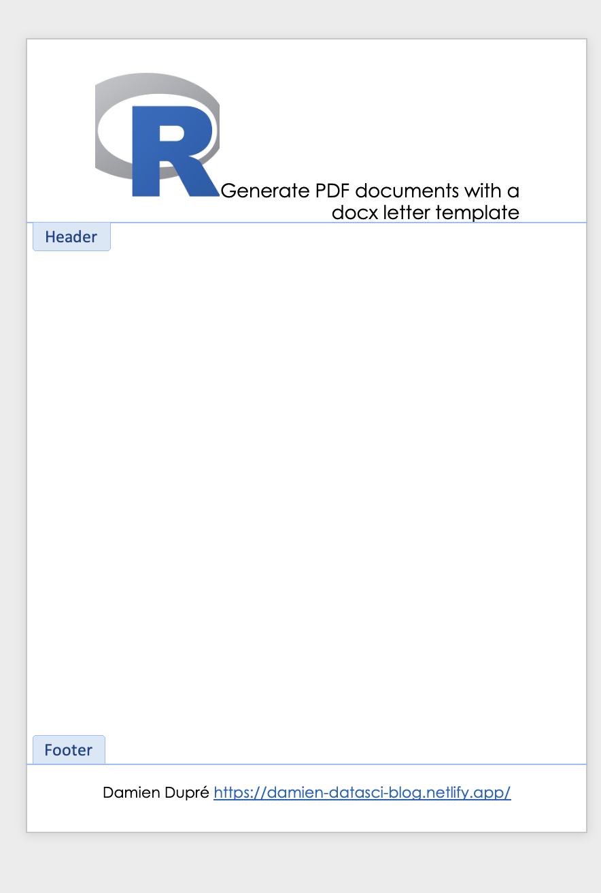
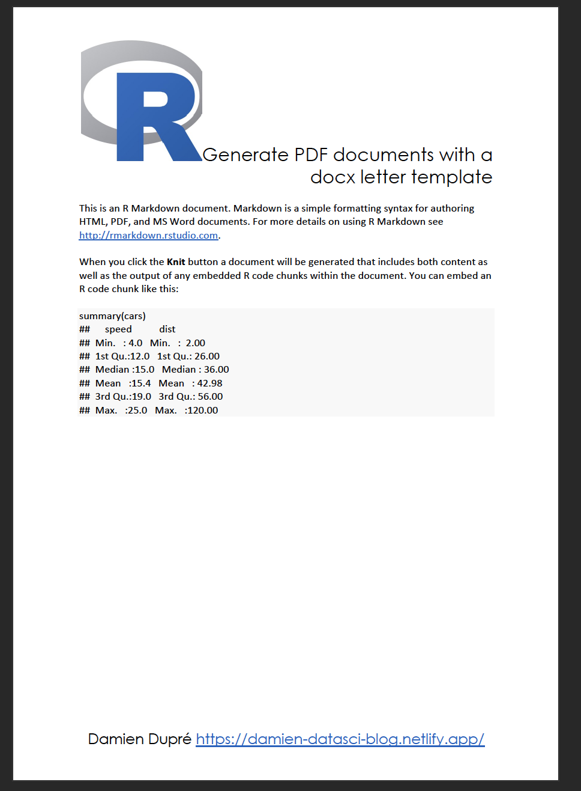

Like you, I am learning new possibilities with Rmarkdown every day, literally. Here is one that I would like to share with you: **Generating PDF documents with a docx letter template**. 

Among my administrative responsibilities, I have to provide letters using the same sentences but with different information. This is the perfect use case for a Rmarkdown with parameters. If you are not familiar with this Rmarkdown goodness, have a look at [Xie, Allaire, and Grolemund's *R Markdown: The Definitive Guide*](https://bookdown.org/yihui/rmarkdown/params-knit.html). However, the design of output documents can be tricky to manipulate, specially if you want to obtain a PDF document. 

By default, `output: pdf_document` is a blank page. While it is possible to obtain some templates from multiple packages to improve it (see a non exhaustive list from the [Rstudio Gallery](https://rmarkdown.rstudio.com/gallery.html)), **there is little possibilities to use our own custom background**.



```{r echo=FALSE, fig.cap="Screenshot of a word template with header and footer only.", fig.align="center"}
#knitr::include_graphics("/img/docx2pdf_template.png", error = FALSE)
```

Here is my hack, **create a word document using `output:word_document`, add a template letter with the option `reference_docx: "your_template.docx"`, and convert it to PDF**. Warning: Only text and image in the header and the footer will be kept in the output document (see word screeshot). Then, the conversion to PDF can be done manually by opening the docx file and saving it as PDF but it's much nicer to include this conversion when the document is knitted and this is the main purpose of this post! Here is what the yaml would look like: 

```
---
output:
  word_document:
    reference_docx: "your_template.docx"
knit: (
  function(inputFile, encoding) {
    rmarkdown::render(
      input = inputFile,
      encoding = encoding,
      output_file = "rmd_output.docx"
      ); doconv::docx2pdf("rmd_output.docx")
    }
  )
---
```

Let's try to understand what happened. As indicated, `output: word_document: reference_docx: "your_template.docx"` produces a docx document with your docx template containing your logo or the letter design of your organisation.


```{r echo=FALSE, fig.cap="Full Rmarkdown file to test the template.", fig.align="center"}
#knitr::include_graphics("/img/docx2pdf_rmd.png", error = FALSE)
```

The `knit` option defines how the document is rendered, the argument `output_file` tells where to save the output and how to call it. Now, to chain another operation, use the symbol `;`. It is usually not very useful except to print an object after creating it but, here, it's the only way I found to add more R code in the YAML. To convert the docx as PDF, I use the recent {doconv} package by [David Gohel](https://github.com/ardata-fr/doconv). It uses either ‘LibreOffice’ or a python library called **docx2pdf**. Unfortunately, the ‘LibreOffice’ conversion does not keep the structure of the docx when converting to PDF, so we need to use docx2pdf and this requires having python3 installed on your computer and then running the function `doconv::docx2pdf_install()`.

And that's it, a PDF document will be created with the same name as you docx document!



```{r echo=FALSE, fig.cap="Screenshot of the PDF output.", fig.align="center"}
#knitr::include_graphics("/img/docx2pdf_pdf.png", error = FALSE)
```

Warning: I tried it on Windows and MacOS Intel, it works perfectly but for MacOS M1 docx2pdf is not find by the function `docx2pdf()`. To solve this, identify what is the path of docx2pdf on your computer with a `which docx2pdf` in the terminal and use the full path as follow:


```
---
output:
  word_document:
    reference_docx: "your_template.docx"
knit: (
  function(inputFile, encoding) {
    rmarkdown::render(
      input = inputFile,
      encoding = encoding,
      output_file = "rmd_output.docx"
      ); system("/path/to/docx2pdf rmd_output.docx")
    }
  )
---
```